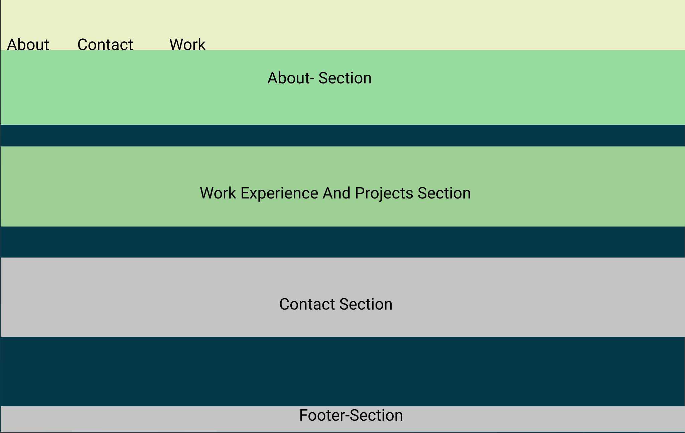

# portfolio-project-abhishekpundir789
<h1>Hi there</h1>,  <h3>I will be creating my portfolio as a project in React which will be responsive and also helps me in better understanding how React framework works.</h3><h4>As being a beginner and learning all these technologies will be an opprotunity for me to look forward my field of expertise and help me grow there. </h4>
<ul><h5>Overview about the Portfolio project:</h5> 
<li>This project will inlcude Home Page with short Introduction</li>
<li>It will also inlcude Portfolio Page in which my educational background, past work experience and projects will be there. </li>
<li>There will be a contact page through which anyone have any questions can contact me or (if want to) appreciate my work.</li>
<li>Some of the link for my social media profiles. </li>
</ul> 
<ul><h5>Tehnologies used for wireframe and prototypes:</h5>
<li>Figma</li>
<li>Moqups </li>
</ul> 
<h3>Prototype made by using Figma</h3>
</img>